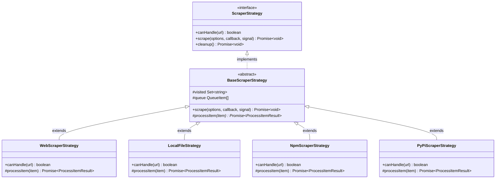
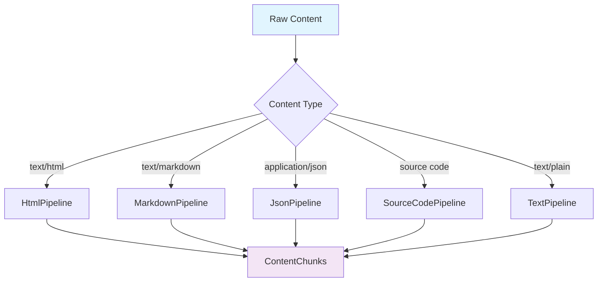
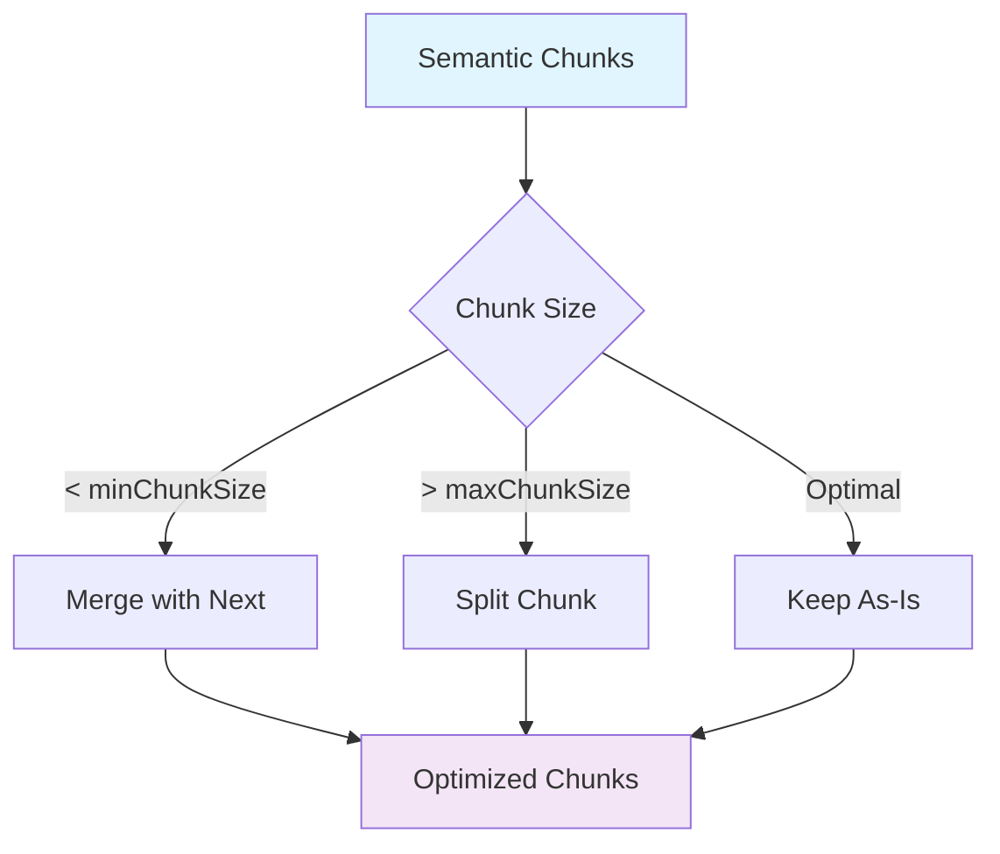
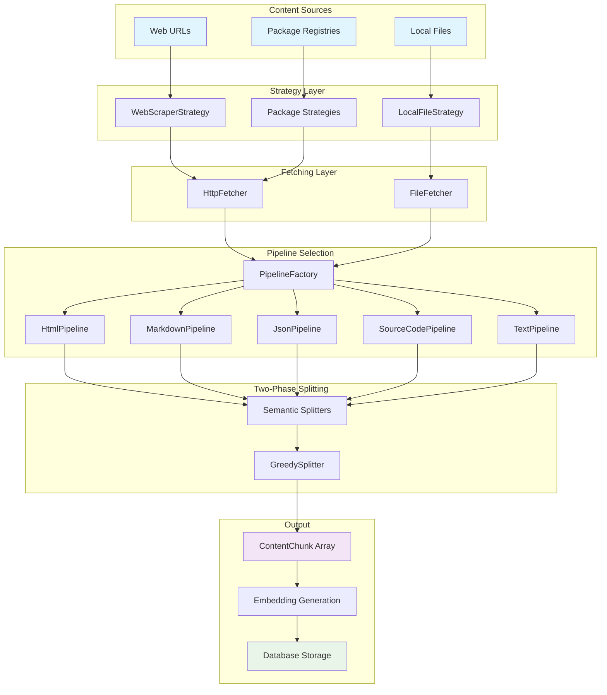
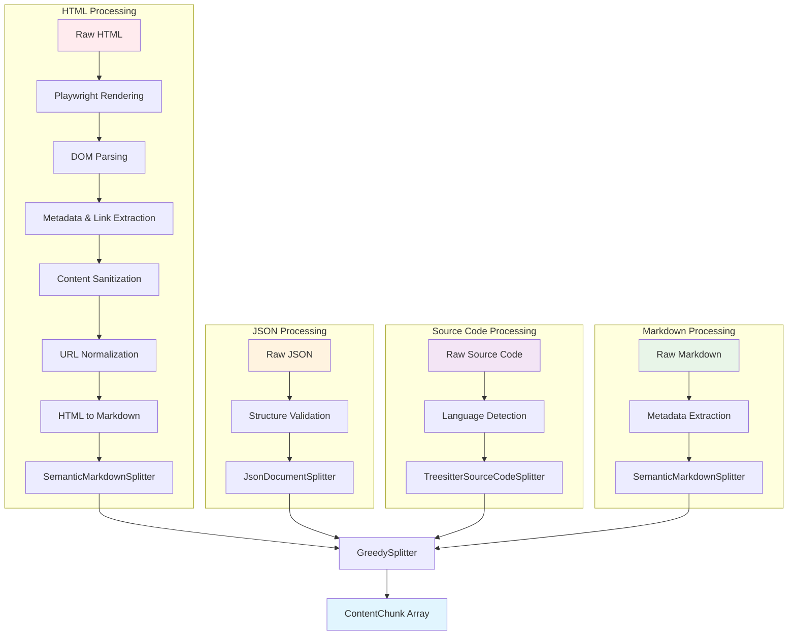

The content processing system transforms raw content from various sources into searchable document chunks through a modular strategy-pipeline-splitter architecture.

## Processing Overview

Content flows through multiple stages from source to searchable chunks:


Each stage is specialized for different content types while maintaining a consistent interface.

## Strategy Pattern Architecture

The system uses the Strategy pattern to handle different content sources:



**Code References**:
- `src/scraper/types.ts` - ScraperStrategy interface
- `src/scraper/strategies/BaseScraperStrategy.ts` - Abstract base
- `src/scraper/strategies/*.ts` - Concrete implementations

## Content Sources

### Web Scraper Strategy

**Handles**: HTTP/HTTPS URLs with JavaScript rendering support

**Features**:
- Playwright for JavaScript-heavy sites
- Automatic link discovery and crawling
- Scope filtering (same domain, path prefix)
- Retry logic with exponential backoff
- Rate limiting and politeness delays

**Code Reference**: `src/scraper/strategies/WebScraperStrategy.ts`

### Local File Strategy

**Handles**: Local filesystem access with directory traversal

**Features**:
- Recursive directory scanning
- File type filtering (`.md`, `.txt`, `.json`, etc.)
- Git-aware (respects `.gitignore`)
- Symbolic link handling
- MIME type detection

**Code Reference**: `src/scraper/strategies/LocalFileStrategy.ts`

### Package Registry Strategies

**NPM Strategy**:
- Fetches package documentation from npm registry
- Extracts README and type definitions
- Version-specific documentation

**PyPI Strategy**:
- Fetches Python package documentation
- Extracts long description and metadata
- Support for Sphinx documentation links

**Code References**:
- `src/scraper/strategies/NpmScraperStrategy.ts`
- `src/scraper/strategies/PyPiScraperStrategy.ts`

## Content Fetchers

Abstract content retrieval across different sources:

### HTTP Fetcher

**Location**: `src/scraper/fetcher/HttpFetcher.ts`

**Capabilities**:
- Standard HTTP requests with headers
- Playwright rendering for dynamic content
- Automatic retry with backoff
- Error classification and handling
- Response caching

<Info>
The fetcher automatically detects when JavaScript rendering is needed based on content type and response headers.
</Info>

### File Fetcher

**Location**: `src/scraper/fetcher/FileFetcher.ts`

**Capabilities**:
- Local filesystem access
- MIME type detection
- Character encoding resolution
- Binary file filtering
- Symbolic link dereferencing

## Processing Pipelines

Transform raw content using middleware chains and content-type-specific logic:



### HTML Pipeline

**Location**: `src/scraper/pipelines/HtmlPipeline.ts`

Most extensive middleware pipeline for web content:

1. **Dynamic Content Rendering**: Optional Playwright rendering for JavaScript
2. **DOM Parsing**: Convert HTML string to manipulable DOM (Cheerio)
3. **Metadata Extraction**: Extract title from `<title>` or `<h1>`
4. **Link Discovery**: Gather all links for crawler
5. **Content Sanitization**: Remove navigation, footers, ads, boilerplate
6. **URL Normalization**: Convert relative URLs to absolute, clean non-functional links
7. **Markdown Conversion**: Convert clean HTML to Markdown

<Note>
Middleware order is critical - sanitization happens before URL normalization to avoid processing irrelevant content.
</Note>

### Markdown Pipeline

**Location**: `src/scraper/pipelines/MarkdownPipeline.ts`

Lighter processing for Markdown files:

1. **Front Matter Extraction**: Parse YAML/TOML front matter
2. **Metadata Extraction**: Extract title, description
3. **Link Processing**: Resolve relative links

### JSON Pipeline

**Location**: `src/scraper/pipelines/JsonPipeline.ts`

Minimal middleware to preserve structure:

1. **Structure Validation**: Ensure valid JSON
2. **Metadata Extraction**: Extract schema information

### Source Code Pipeline

**Location**: `src/scraper/pipelines/SourceCodePipeline.ts`

Language-aware processing:

1. **Language Detection**: Identify programming language
2. **Syntax Validation**: Check for parse errors
3. **Comment Extraction**: Preserve documentation comments

### Text Pipeline

**Location**: `src/scraper/pipelines/TextPipeline.ts`

Fallback for generic text:

1. **Encoding Detection**: Ensure correct character encoding
2. **Basic Metadata**: Extract filename and size

## Document Splitting

Two-phase approach: semantic splitting preserves structure, size optimization ensures embedding quality.

### Phase 1: Semantic Splitting

Content-type-specific splitters preserve document structure:

#### Semantic Markdown Splitter

**Location**: `src/splitter/SemanticMarkdownSplitter.ts`

**Strategy**:
- Analyzes heading hierarchy (H1-H6)
- Creates hierarchical paths like `["Guide", "Installation", "Setup"]`
- Preserves code blocks, tables, and list structures
- Maintains parent-child relationships

**Example**:
```markdown
# Guide
## Installation
### Setup
Content here...
```

**Result**: Chunk with path `["Guide", "Installation", "Setup"]`

#### JSON Document Splitter

**Location**: `src/splitter/JsonDocumentSplitter.ts`

**Strategy**:
- Object and property-level splitting
- Hierarchical path construction
- Concatenation-friendly design
- Structural context preservation

**Example**:
```json
{
  "api": {
    "endpoints": {
      "users": {...}
    }
  }
}
```

**Result**: Chunk with path `["api", "endpoints", "users"]`

#### Text Document Splitter

**Location**: `src/splitter/TextDocumentSplitter.ts`

**Strategy**:
- Line-based splitting with context
- Simple hierarchical structure
- Language-aware processing
- Fallback for unsupported content

<Note>
This is a temporary splitter. A syntax-aware Tree-sitter implementation is planned for better semantic boundaries in source code.
</Note>

### Phase 2: Size Optimization

**Location**: `src/splitter/GreedySplitter.ts`

Universal optimization across all content types:



**Optimization Process**:
1. **Greedy Concatenation**: Merge small chunks until minimum size
2. **Boundary Respect**: Preserve major section breaks (H1/H2)
3. **Metadata Merging**: Combine chunk metadata intelligently
4. **Context Preservation**: Maintain hierarchical relationships

**Configuration**:

| Setting | Role | Default |
|---------|------|--------|
| `minChunkSize` | Floor for merging | 500 chars |
| `preferredChunkSize` | Soft target | 1500 chars |
| `maxChunkSize` | Hard ceiling | 3000 chars |

<Info>
All sizes are measured in **characters** (`string.length`), not tokens. The actual token count depends on the embedding model's tokenizer.
</Info>

**Code Reference**: `src/splitter/GreedySplitter.ts`

## Content Processing Flow

Complete flow from source to embedded chunks:



## Content-Type-Specific Processing

Different content types follow specialized paths:



**Processing Differences**:

- **HTML**: Multi-stage middleware pipeline for cleaning and conversion
- **JSON**: Structural validation with hierarchical splitting
- **Source Code**: Tree-sitter semantic boundary detection
- **Markdown**: Direct semantic splitting with metadata

All types converge on `GreedySplitter` for universal size optimization.

## Chunk Structure

### Hierarchical Organization

Chunks maintain hierarchical relationships through path-based organization:

```typescript
interface ContentChunk {
  content: string;              // Chunk content
  path: string[];               // Hierarchical path
  metadata: {
    url: string;                // Source URL
    title: string;              // Page/section title
    contentType: string;        // MIME type
    // ... additional metadata
  };
}
```

**Relationships**:
- **Parent**: Path with one fewer element
- **Children**: Paths extending current by one level
- **Siblings**: Same path length with shared parent
- **Context**: Related chunks in search results

### Search Context Retrieval

<Info>
When returning search results, the system automatically includes contextual chunks for comprehensive understanding.
</Info>

Context includes:
- The matching chunk itself
- Parent chunks for broader context
- Previous and following siblings for navigation
- Direct child chunks for deeper exploration

**Code Reference**: `src/store/DocumentRetrieverService.ts`

## Error Handling

### Content Filtering

Automatic filtering of low-quality content:

- Navigation menus and sidebars
- Advertisement content and widgets
- Boilerplate text and templates
- Duplicate content detection
- Minimum content length thresholds

**Code Reference**: `src/scraper/middleware/sanitization/`

### Error Recovery

Graceful handling of processing errors:

| Error Type | Strategy |
|------------|----------|
| Recoverable | Retry with exponential backoff |
| Content | Skip page and continue processing |
| Fatal | Stop job with detailed error info |
| Warning | Log and continue |

**Code Reference**: `src/pipeline/PipelineWorker.ts`

### Progress Tracking

Real-time processing feedback:

- Page-level progress updates
- Processing rate metrics (pages/min)
- Error count and classification
- Memory usage monitoring

**Code Reference**: `src/pipeline/PipelineManager.ts`

## System Integration

Content processing integrates with downstream components:


**Integration Points**:
- **Embedding Generation**: Consistent chunk formatting enables seamless vector generation
- **Database Storage**: Hierarchical paths and metadata support efficient indexing
- **Search System**: Context-aware results leverage chunk relationships

## Performance Optimization

### Parallel Processing

<Note>
The system processes multiple pages concurrently while respecting rate limits and politeness delays.
</Note>

**Concurrency Controls**:
- Configurable worker pool size
- Rate limiting per domain
- Memory-based backpressure
- Graceful degradation under load

### Caching Strategy

**HTTP Response Caching**:
- In-memory cache for recent fetches
- Respects `Cache-Control` headers
- Reduces redundant requests

**Embedding Caching**:
- Reuse embeddings for unchanged content
- Content hash-based cache keys
- Automatic invalidation on updates

### Resource Management

**Memory Management**:
- Streaming processing for large files
- Incremental chunk generation
- Automatic garbage collection hints

**Playwright Optimization**:
- Browser instance pooling
- Page context reuse
- Automatic cleanup on errors

## Next Steps

<CardGroup cols={2}>
  <Card title="Pipeline System" icon="gears" href="/architecture/pipeline-system">
    Learn about job processing and workers
  </Card>
  <Card title="Architecture Overview" icon="sitemap" href="/architecture/overview">
    Understand overall system design
  </Card>
</CardGroup>
