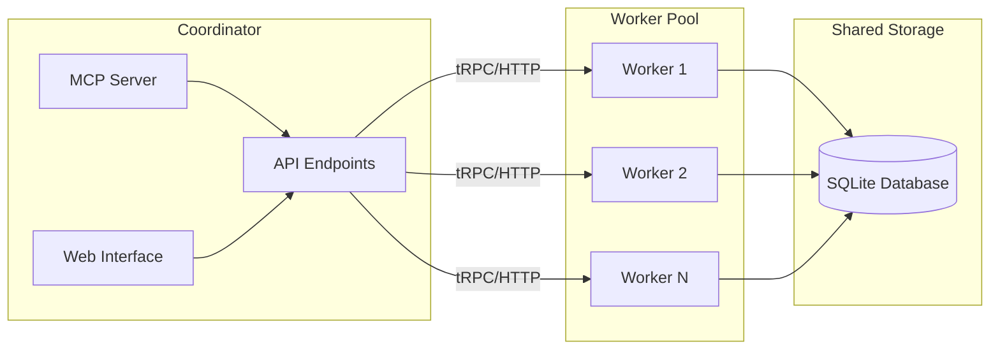
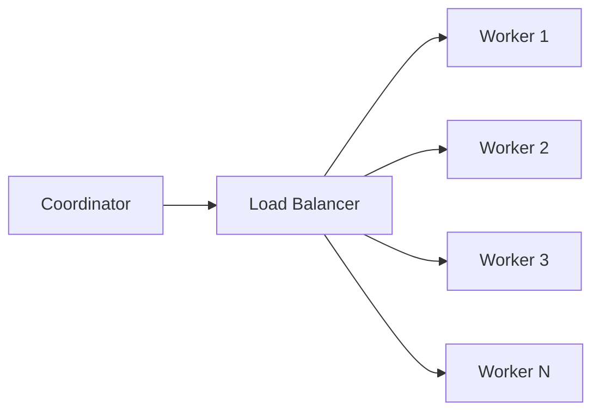

The system supports two deployment patterns optimized for different use cases, from single-process simplicity to multi-container scaling.

## Unified Server Mode

Single process containing all services on one port (default: 6280). This mode combines:

- MCP server accessible via `/mcp` and `/sse` endpoints
- Web interface for job management
- Embedded worker for document processing
- API (tRPC over HTTP) for programmatic access

### Use Cases

<CardGroup cols={2}>
  <Card title="Development" icon="laptop-code">
    Fast iteration with hot reload
  </Card>
  <Card title="Single Container" icon="box">
    Simple production deployments
  </Card>
  <Card title="Local Indexing" icon="folder">
    Personal documentation management
  </Card>
  <Card title="Prototyping" icon="flask">
    Quick setup and testing
  </Card>
</CardGroup>

### Service Configuration

Services can be selectively enabled via `AppServerConfig`:

```typescript
{
  enableMcpServer: true,      // MCP protocol endpoint
  enableWebInterface: true,   // Web UI and management API
  enableWorker: true,         // Embedded job processing
  enableApiServer: true       // HTTP API at /api
}
```

**Code Reference**: `src/app/AppServerConfig.ts`

### Starting Unified Server

```bash
# Default unified mode with all services
npm start

# Explicit HTTP protocol
docs-mcp-server --protocol http --port 6280
```

## Distributed Mode

Separate coordinator and worker processes for scaling. The coordinator handles interfaces while workers process jobs independently.

### Architecture



<Note>
**Communication**: Coordinators use tRPC over HTTP for commands and WebSocket for real-time events from workers.
</Note>

### Components

**Coordinator**:
- Runs MCP server, web interface, and API
- Delegates processing to external workers
- No embedded worker (uses `PipelineClient`)
- Lightweight, stateless interface layer

**Workers**:
- Execute document processing jobs
- Run `PipelineManager` with embedded workers
- Expose tRPC API for job management
- Independent job recovery and state management

### Use Cases

<CardGroup cols={2}>
  <Card title="High Volume" icon="chart-line">
    Process large documentation sets
  </Card>
  <Card title="Container Orchestration" icon="cubes">
    Kubernetes, Docker Swarm deployments
  </Card>
  <Card title="Horizontal Scaling" icon="arrows-left-right">
    Add workers based on load
  </Card>
  <Card title="Resource Isolation" icon="shield">
    Separate processing from interfaces
  </Card>
</CardGroup>

### Starting Distributed Mode

**Coordinator**:
```bash
# Connect to external worker
docs-mcp-server mcp --server-url http://worker:8080/api
```

**Worker**:
```bash
# Run as processing worker
docs-mcp-server worker --port 8080
```

## Protocol Auto-Detection

The system automatically selects the communication protocol based on execution environment, enabling seamless integration with different tools.

### Detection Logic

```javascript
if (!process.stdin.isTTY && !process.stdout.isTTY) {
  return "stdio";  // AI tools, CI/CD
} else {
  return "http";   // Interactive terminals
}
```

**Code Reference**: `src/index.ts`

### Stdio Mode

<Info>
Automatically selected when stdin/stdout are not TTY (terminal). Used by VS Code, Claude Desktop, and other AI tools.
</Info>

**Characteristics**:
- Direct MCP communication via stdin/stdout
- No HTTP server required
- Minimal resource usage
- Binary protocol for efficiency

**Example Usage**:
```json
// Claude Desktop config
{
  "mcpServers": {
    "docs": {
      "command": "docs-mcp-server",
      "args": []
    }
  }
}
```

### HTTP Mode

<Info>
Automatically selected when running in an interactive terminal. Provides full web interface and API access.
</Info>

**Characteristics**:
- Server-Sent Events transport for MCP
- Full web interface at root URL
- API accessible at `/api`
- MCP endpoints at `/mcp` and `/sse`

**Endpoints**:
- `http://localhost:6280/` - Web UI
- `http://localhost:6280/mcp` - MCP over Streamable HTTP
- `http://localhost:6280/sse` - MCP over Server-Sent Events
- `http://localhost:6280/api` - tRPC API

### Manual Override

Protocol can be explicitly set via `--protocol` flag, bypassing auto-detection:

```bash
# Force stdio mode
docs-mcp-server --protocol stdio

# Force HTTP mode
docs-mcp-server --protocol http
```

## Configuration

Deployment settings are resolved through a layered configuration system:

**Priority Order** (highest to lowest):
1. CLI arguments (`--protocol`, `--port`, `--server-url`)
2. Environment variables (`DOCS_MCP_PROTOCOL`, `DOCS_MCP_PORT`)
3. Config file (`docs-mcp.config.yaml` or `DOCS_MCP_CONFIG`)
4. Built-in defaults

### Key Configuration Options

| Option | Environment Variable | CLI Flag | Default | Description |
|--------|---------------------|----------|---------|-------------|
| Protocol | `DOCS_MCP_PROTOCOL` | `--protocol` | auto | Transport protocol (stdio/http) |
| Port | `DOCS_MCP_PORT` | `--port` | 6280 | HTTP server port |
| Server URL | `DOCS_MCP_SERVER_URL` | `--server-url` | - | External worker URL |
| Concurrency | `DOCS_MCP_CONCURRENCY` | - | 3 | Worker concurrency limit |

**Code Reference**: `src/utils/config.ts`

## Job Recovery

Job recovery behavior differs based on deployment mode to prevent conflicts and ensure data consistency.

### Unified Server Mode

<Note>
Embedded worker recovers pending jobs from database on startup, ensuring no work is lost during restarts.
</Note>

**Recovery Process**:
1. Load `QUEUED` and `RUNNING` jobs from database
2. Reset `RUNNING` jobs to `QUEUED` state
3. Resume processing with original configuration
4. Maintain progress history

**Enabled by**: `recoverJobs: true` in PipelineFactory

### Distributed Mode

<Note>
Workers handle their own job recovery. Coordinators do not recover jobs to avoid conflicts with worker state.
</Note>

**Worker Recovery**:
- Each worker maintains independent job state
- Workers recover jobs on startup
- Coordinator remains stateless

**Coordinator Behavior**:
- No job recovery (uses PipelineClient)
- Delegates all processing to workers
- Queries worker for job status

### CLI Commands

<Note>
CLI commands execute immediately without job recovery to prevent conflicts with concurrent usage.
</Note>

**Characteristics**:
- `recoverJobs: false` in PipelineFactory
- Immediate execution model
- Safe for concurrent CLI operations
- No persistent job state

**Code Reference**: `src/pipeline/PipelineFactory.ts`

## Container Deployment

### Single Container

Simple deployment for unified server mode:

```dockerfile
FROM ghcr.io/arabold/docs-mcp-server:latest
EXPOSE 6280
CMD ["--protocol", "http", "--port", "6280"]
```

**Docker Run**:
```bash
docker run -p 6280:6280 \
  -v ./data:/data \
  ghcr.io/arabold/docs-mcp-server:latest
```

### Multi-Container (Docker Compose)

Distributed deployment with separate coordinator and workers:

```yaml
services:
  coordinator:
    image: ghcr.io/arabold/docs-mcp-server:latest
    ports:
      - "6280:6280"
    command: ["mcp", "--server-url", "http://worker:8080/api"]
    depends_on:
      - worker

  worker:
    image: ghcr.io/arabold/docs-mcp-server:latest
    ports:
      - "8080:8080"
    volumes:
      - worker-data:/data
    command: ["worker", "--port", "8080"]

volumes:
  worker-data:
```

### Kubernetes Deployment

Scalable deployment with multiple workers:

```yaml
apiVersion: apps/v1
kind: Deployment
metadata:
  name: docs-mcp-coordinator
spec:
  replicas: 2
  template:
    spec:
      containers:
      - name: coordinator
        image: ghcr.io/arabold/docs-mcp-server:latest
        args: ["mcp", "--server-url", "http://docs-mcp-worker:8080/api"]
        ports:
        - containerPort: 6280
---
apiVersion: apps/v1
kind: Deployment
metadata:
  name: docs-mcp-worker
spec:
  replicas: 3  # Scale workers based on load
  template:
    spec:
      containers:
      - name: worker
        image: ghcr.io/arabold/docs-mcp-server:latest
        args: ["worker", "--port", "8080"]
        ports:
        - containerPort: 8080
```

## Load Balancing

### Multiple Workers

Use a load balancer or DNS round-robin in front of multiple worker instances:



**Configuration**:
```bash
# Coordinator points to load balancer
docs-mcp-server mcp --server-url http://worker-lb:8080/api
```

### Health Checks

Workers can expose health endpoints for monitoring:

```yaml
healthcheck:
  test: ["CMD", "curl", "-f", "http://localhost:8080/health"]
  interval: 30s
  timeout: 10s
  retries: 3
```

### Scaling Strategies

<CardGroup cols={3}>
  <Card title="Horizontal" icon="arrows-left-right">
    Add more worker containers based on queue depth
  </Card>
  <Card title="Vertical" icon="arrow-up">
    Increase worker CPU/memory allocation
  </Card>
  <Card title="Hybrid" icon="layer-group">
    Combine both strategies for optimal scaling
  </Card>
</CardGroup>

**Horizontal Scaling**:
- Add workers when queue depth exceeds threshold
- Remove workers when idle
- Auto-scaling based on metrics

**Vertical Scaling**:
- Increase concurrency limit per worker
- Allocate more memory for large documents
- Faster embedding generation with GPU

## Next Steps

<CardGroup cols={2}>
  <Card title="Pipeline System" icon="gears" href="/architecture/pipeline-system">
    Learn about job processing architecture
  </Card>
  <Card title="Configuration" icon="sliders" href="/setup/configuration">
    Configure deployment settings
  </Card>
</CardGroup>
