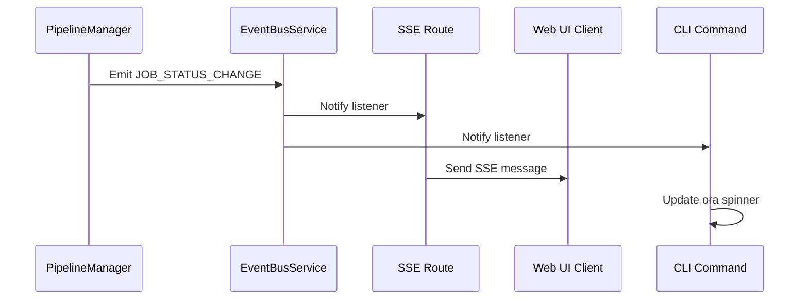
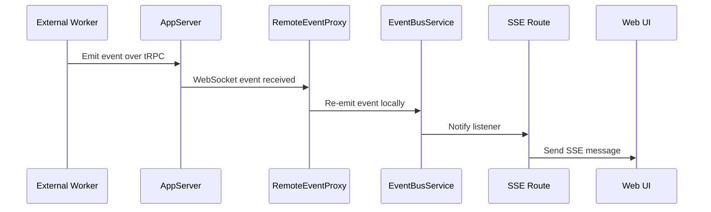

The event-driven architecture uses a central event bus to decouple event producers from consumers, enabling flexible and scalable real-time status updates across all interfaces.

## Overview

The core of the system is the `EventBusService`, an in-memory pub/sub service that allows different parts of the application to emit events without being directly coupled to the components that consume them.

<Info>
The event bus achieves two primary goals: **decoupling** components and enabling **real-time updates** across all interfaces.
</Info>

**Key Benefits**:
- **Decoupling**: PipelineManager doesn't know about web server or clients
- **Real-Time**: UI receives immediate feedback on job progress
- **Scalability**: Multiple consumers can subscribe to same events
- **Flexibility**: Add new consumers without modifying producers

## Core Components

| Component | Location | Role |
|-----------|----------|------|
| `PipelineManager` | `src/pipeline/` | Primary event **producer** for job-related events |
| `EventBusService` | `src/events/` | Central pub/sub bus distributing events to listeners |
| `SSE Route` | `src/web/routes/events.ts` | **Consumer** forwarding events to web UI via SSE |
| `RemoteEventProxy` | `src/events/` | Subscribes to remote worker events and re-emits locally |
| `CLI Commands` | `src/cli/commands/` | **Consumer** displaying progress indicators |

## Event Bus Service

**Location**: `src/events/EventBusService.ts`

Simple in-memory pub/sub implementation:

```typescript
class EventBusService {
  private listeners: Map<string, Set<EventListener>>;

  // Register event listener
  on(event: string, callback: EventListener): void {
    if (!this.listeners.has(event)) {
      this.listeners.set(event, new Set());
    }
    this.listeners.get(event).add(callback);
  }

  // Emit event to all listeners
  emit(event: string, data: unknown): void {
    const listeners = this.listeners.get(event);
    if (listeners) {
      for (const callback of listeners) {
        callback(data);
      }
    }
  }

  // Remove listener
  off(event: string, callback: EventListener): void {
    const listeners = this.listeners.get(event);
    if (listeners) {
      listeners.delete(callback);
    }
  }
}
```

<Note>
The event bus is synchronous within a process but becomes asynchronous across processes in distributed mode via WebSocket.
</Note>

## Event Types

The system defines specific event types for different operations:

### Job Status Change

**Event Name**: `JOB_STATUS_CHANGE`

**Payload**:
```typescript
interface PipelineJob {
  id: string;
  libraryName: string;
  version: string;
  status: 'QUEUED' | 'RUNNING' | 'COMPLETED' | 'FAILED' | 'CANCELLED';
  progress?: ScraperProgressEvent;
  error?: string;
  // ...
}
```

**Fired When**:
- Job transitions between states
- Status updates from workers
- Manual job cancellation

**Example**:
```typescript
await this.updateJobStatus(jobId, 'RUNNING');
this.eventBus.emit('JOB_STATUS_CHANGE', job);
```

**Code Reference**: `src/pipeline/PipelineManager.ts`

### Job Progress

**Event Name**: `JOB_PROGRESS`

**Payload**:
```typescript
interface JobProgressEvent {
  job: PipelineJob;
  progress: {
    pagesDiscovered: number;
    pagesProcessed: number;
    currentUrl?: string;
    status: string;
    errors?: string[];
  };
}
```

**Fired When**:
- Page processing completes
- Progress milestones reached
- Processing rate updates

**Example**:
```typescript
this.eventBus.emit('JOB_PROGRESS', {
  job,
  progress: {
    pagesDiscovered: 50,
    pagesProcessed: 25,
    currentUrl: 'https://example.com/docs/api'
  }
});
```

**Code Reference**: `src/pipeline/PipelineWorker.ts`

### Library Change

**Event Name**: `LIBRARY_CHANGE`

**Payload**: `undefined` (broadcast notification)

**Fired When**:
- Library added or removed
- Version indexed or deleted
- Library metadata updated

**Example**:
```typescript
await this.deleteLibrary(libraryId);
this.eventBus.emit('LIBRARY_CHANGE');
```

**Code Reference**: `src/store/DocumentManagementService.ts`

## Local Event Flow

In unified mode, events flow within a single process:



**Flow Steps**:
1. `PipelineManager` updates job status and emits event to `EventBusService`
2. `EventBusService` forwards event to all registered listeners:
   - SSE Route for web UI updates
   - CLI commands for terminal progress
3. SSE Route formats event and sends to connected web clients
4. CLI commands update their progress indicators (e.g., `ora` spinner)

<Note>
All events are synchronous within the same process, ensuring immediate notification of all consumers.
</Note>

## Remote Event Flow

In distributed mode, `RemoteEventProxy` bridges events from external workers:



**Flow Steps**:
1. Event occurs in external worker process
2. Event sent to `AppServer` via tRPC WebSocket subscription
3. `RemoteEventProxy` receives event and re-emits on local `EventBusService`
4. Event follows same flow as local events (SSE Route → Web UI)

<Info>
The proxy makes distributed execution transparent to consumers - they use the same EventBus API regardless of deployment mode.
</Info>

**Code Reference**: `src/events/RemoteEventProxy.ts`

## Event Producer Implementation

### Pipeline Manager

The primary event producer for job-related events:

```typescript
class PipelineManager implements IPipeline {
  constructor(
    private eventBus: EventBusService,
    // ...
  ) {}

  private async updateJobStatus(
    jobId: string,
    status: JobStatus
  ): Promise<void> {
    const job = this.jobs.get(jobId);
    job.status = status;
    
    // Persist to database (write-through)
    await this.docService.updateVersion(jobId, { status });
    
    // Emit event to all consumers
    this.eventBus.emit('JOB_STATUS_CHANGE', job);
  }

  private reportProgress(
    job: PipelineJob,
    progress: ScraperProgressEvent
  ): void {
    // Update job state
    job.progress = progress;
    
    // Emit progress event
    this.eventBus.emit('JOB_PROGRESS', { job, progress });
  }
}
```

**Key Points**:
- Emits events after state persistence (write-through)
- No knowledge of consumers
- Simple, synchronous event emission

**Code Reference**: `src/pipeline/PipelineManager.ts`

## Event Consumer Implementations

### Server-Sent Events Route

**Location**: `src/web/routes/events.ts`

Forwards events to web UI clients via SSE:

```typescript
app.get('/events', (req, res) => {
  // Setup SSE connection
  res.writeHead(200, {
    'Content-Type': 'text/event-stream',
    'Cache-Control': 'no-cache',
    'Connection': 'keep-alive'
  });

  // Subscribe to EventBus
  const handler = (data: unknown) => {
    res.write(`data: ${JSON.stringify(data)}\n\n`);
  };

  eventBus.on('JOB_STATUS_CHANGE', handler);
  eventBus.on('JOB_PROGRESS', handler);
  eventBus.on('LIBRARY_CHANGE', handler);

  // Cleanup on disconnect
  req.on('close', () => {
    eventBus.off('JOB_STATUS_CHANGE', handler);
    eventBus.off('JOB_PROGRESS', handler);
    eventBus.off('LIBRARY_CHANGE', handler);
  });
});
```

**Features**:
- Long-lived HTTP connection
- Automatic reconnection in client
- JSON-formatted event data
- Cleanup on disconnect

### CLI Progress Indicators

**Location**: `src/cli/commands/*.ts`

Display real-time progress in terminal:

```typescript
import ora from 'ora';

async function scrapeCommand(options: ScrapeOptions) {
  const spinner = ora('Queueing job...').start();

  const jobId = await pipeline.enqueueScrapeJob(options);

  // Subscribe to events
  const statusHandler = (job: PipelineJob) => {
    if (job.id !== jobId) return;

    switch (job.status) {
      case 'RUNNING':
        spinner.text = 'Processing...';
        break;
      case 'COMPLETED':
        spinner.succeed('Job completed!');
        break;
      case 'FAILED':
        spinner.fail(`Job failed: ${job.error}`);
        break;
    }
  };

  const progressHandler = (event: JobProgressEvent) => {
    if (event.job.id !== jobId) return;
    spinner.text = `Processed ${event.progress.pagesProcessed}/${event.progress.pagesDiscovered} pages`;
  };

  eventBus.on('JOB_STATUS_CHANGE', statusHandler);
  eventBus.on('JOB_PROGRESS', progressHandler);

  // Wait for completion
  await waitForJobCompletion(jobId);

  // Cleanup
  eventBus.off('JOB_STATUS_CHANGE', statusHandler);
  eventBus.off('JOB_PROGRESS', progressHandler);
}
```

**Features**:
- Real-time progress spinner
- Status-based updates
- Automatic cleanup
- Job-specific filtering

**Code Reference**: `src/cli/commands/scrape.ts`

### Web UI Components

**Location**: `src/web/components/`

AlpineJS components subscribe to SSE events:

```html
<div x-data="jobProgress('${jobId}')">
  <div class="progress-bar">
    <div :style="`width: ${progress}%`"></div>
  </div>
  <span x-text="statusText"></span>
</div>

<script>
function jobProgress(jobId) {
  return {
    progress: 0,
    statusText: 'Queued',

    init() {
      // Connect to SSE endpoint
      const eventSource = new EventSource('/events');

      eventSource.addEventListener('message', (event) => {
        const data = JSON.parse(event.data);

        if (data.type === 'JOB_PROGRESS' && data.job.id === jobId) {
          const { pagesProcessed, pagesDiscovered } = data.progress;
          this.progress = (pagesProcessed / pagesDiscovered) * 100;
          this.statusText = `${pagesProcessed}/${pagesDiscovered} pages`;
        }

        if (data.type === 'JOB_STATUS_CHANGE' && data.job.id === jobId) {
          this.statusText = data.job.status;
        }
      });
    }
  };
}
</script>
```

**Features**:
- Automatic SSE connection
- Real-time progress updates
- Job-specific filtering
- Reactive UI updates

## Remote Event Proxy

**Location**: `src/events/RemoteEventProxy.ts`

Bridges events from external workers to local EventBus:

```typescript
class RemoteEventProxy {
  constructor(
    private trpcClient: TRPCClient,
    private eventBus: EventBusService
  ) {}

  async start(): Promise<void> {
    // Subscribe to worker events via WebSocket
    const subscription = this.trpcClient.subscribeToEvents.subscribe({
      onData: (event: PipelineEvent) => {
        // Re-emit on local EventBus
        this.eventBus.emit(event.type, event.data);
      },
      onError: (error) => {
        logger.error('Event subscription error:', error);
        this.reconnect();
      }
    });

    this.subscription = subscription;
  }

  async stop(): Promise<void> {
    this.subscription?.unsubscribe();
  }
}
```

**Features**:
- WebSocket subscription to worker
- Automatic reconnection on errors
- Transparent event bridging
- No consumer changes required

<Note>
The proxy makes distributed mode transparent - consumers use the same EventBus API whether the worker is local or remote.
</Note>

## Event Reliability

### Delivery Guarantees

**Local Mode**:
- Synchronous delivery to all listeners
- No message loss within process
- Ordered delivery guaranteed

**Distributed Mode**:
- Best-effort delivery over WebSocket
- Automatic reconnection on disconnect
- May miss events during reconnection
- State sync on reconnection

### Error Handling

**Listener Errors**:
```typescript
emit(event: string, data: unknown): void {
  const listeners = this.listeners.get(event);
  if (listeners) {
    for (const callback of listeners) {
      try {
        callback(data);
      } catch (error) {
        logger.error('Event listener error:', error);
        // Continue to other listeners
      }
    }
  }
}
```

**Connection Errors**:
- Automatic SSE reconnection in browser
- WebSocket reconnection with exponential backoff
- Graceful degradation (polling fallback)

## Performance Considerations

### Event Frequency

<Info>
Progress events are throttled to prevent overwhelming consumers with updates.
</Info>

**Throttling Strategy**:
```typescript
class PipelineWorker {
  private lastProgressEmit = 0;
  private readonly PROGRESS_THROTTLE_MS = 1000;

  private reportProgress(progress: ScraperProgressEvent): void {
    const now = Date.now();
    if (now - this.lastProgressEmit < this.PROGRESS_THROTTLE_MS) {
      return; // Skip this update
    }
    
    this.lastProgressEmit = now;
    this.eventBus.emit('JOB_PROGRESS', { job: this.job, progress });
  }
}
```

**Update Frequencies**:
- Status changes: Immediate
- Progress updates: Max 1/second
- Library changes: Immediate

### Memory Management

**Listener Cleanup**:
```typescript
// Always remove listeners when done
eventBus.off('JOB_STATUS_CHANGE', handler);

// Use AbortSignal for automatic cleanup
const controller = new AbortController();
eventBus.on('JOB_STATUS_CHANGE', handler, { signal: controller.signal });
controller.abort(); // Auto-cleanup
```

**Connection Limits**:
- SSE connections limited per client
- WebSocket connection pooling
- Automatic stale connection cleanup

## Testing Events

### Unit Testing Producers

```typescript
import { vi } from 'vitest';

describe('PipelineManager', () => {
  it('emits JOB_STATUS_CHANGE on status update', async () => {
    const eventBus = new EventBusService();
    const emitSpy = vi.spyOn(eventBus, 'emit');
    
    const manager = new PipelineManager({ eventBus, /* ... */ });
    await manager.updateJobStatus(jobId, 'RUNNING');
    
    expect(emitSpy).toHaveBeenCalledWith('JOB_STATUS_CHANGE', expect.objectContaining({
      id: jobId,
      status: 'RUNNING'
    }));
  });
});
```

### Integration Testing Consumers

```typescript
describe('SSE Route', () => {
  it('forwards events to connected clients', async () => {
    const eventBus = new EventBusService();
    const app = createApp({ eventBus });
    
    const response = await fetch('http://localhost:6280/events');
    const reader = response.body.getReader();
    
    // Emit event
    eventBus.emit('JOB_STATUS_CHANGE', { id: '123', status: 'RUNNING' });
    
    // Verify SSE message
    const { value } = await reader.read();
    const message = new TextDecoder().decode(value);
    expect(message).toContain('data: {"id":"123","status":"RUNNING"}');
  });
});
```

## Next Steps

<CardGroup cols={2}>
  <Card title="Pipeline System" icon="gears" href="/architecture/pipeline-system">
    Learn about job processing and workers
  </Card>
  <Card title="Architecture Overview" icon="sitemap" href="/architecture/overview">
    Understand overall system design
  </Card>
</CardGroup>
