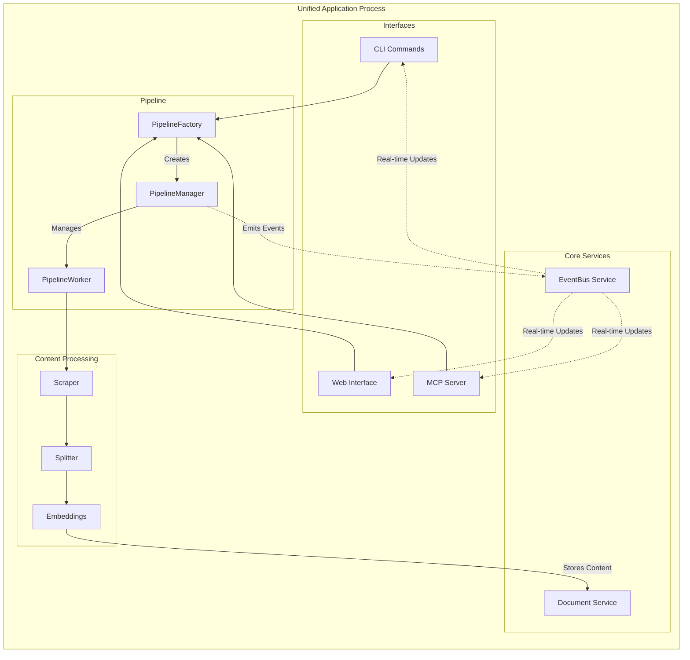
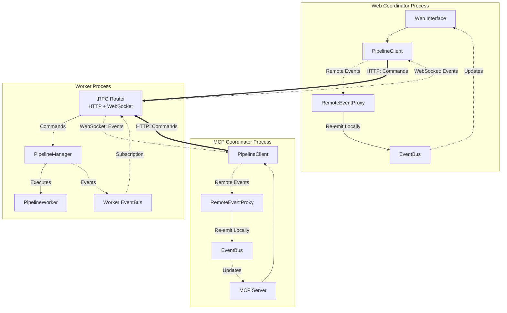

The Grounded Docs MCP Server uses a layered architecture where interfaces delegate to shared tools, which coordinate pipeline operations for content processing and storage. The system supports two deployment modes with automatic protocol detection.

## Core Functions

The system provides comprehensive documentation indexing and search capabilities:

- Documentation scraping from web, local files, npm/PyPI registries
- Semantic search using vector embeddings (OpenAI, Google, Azure, AWS providers)
- Version-specific documentation queries
- Asynchronous job processing with recovery
- Multiple access interfaces: CLI, MCP protocol, web UI

## Technology Stack

<Info>
The system is built with modern Node.js technologies optimized for developer experience and performance.
</Info>

- **Runtime**: Node.js 22.x with TypeScript
- **Build**: Vite with Vitest for testing
- **Web UI**: HTMX, AlpineJS, TailwindCSS
- **Processing**: LangChain.js for embeddings, Playwright for scraping
- **Storage**: SQLite with schema migrations

## System Architecture

The architecture supports two deployment modes with different event flow patterns:

### Unified Mode

In unified mode, all components run within a single process. The `PipelineManager` executes jobs directly and emits events to the local `EventBus`, which notifies all consumers in real-time.



<Note>
**Key Characteristics:**
- Direct method calls between components
- Local event propagation via `EventBus`
- Immediate job status updates
- Simple deployment (single process)
</Note>

### Distributed Mode

In distributed mode, the worker runs as a separate process. Multiple coordinators (Web UI, MCP Server) connect to the shared worker via tRPC. Each coordinator uses `PipelineClient` to send commands over HTTP and receive real-time events via WebSocket.



<Note>
**Key Characteristics:**
- **Hub**: Shared worker process executes all jobs
- **Spokes**: Independent coordinator processes (Web, MCP, CLI)
- **Split-Link Communication**: HTTP for commands, WebSocket for events
- **Event Bridging**: `RemoteEventProxy` makes remote events appear local
- **Scalability**: Multiple coordinators can share one worker
- **Transparency**: Consumers use the same `EventBus` API regardless of mode
</Note>

## Core Components

### Tools Layer

**Location**: `src/tools/`

Business logic resides in the tools layer to enable code reuse across interfaces. Tools operate on shared pipeline and storage services, eliminating interface-specific implementations.

The tools layer includes:
- Document scraping with configuration persistence
- Semantic search across indexed content
- Library and version management
- Job lifecycle management (status, progress, cancellation)
- URL fetching and markdown conversion

### Pipeline Management

**Location**: `src/pipeline/`

The pipeline system manages asynchronous job processing with persistent state and real-time event propagation:

- **PipelineManager**: Coordinates job queue, concurrency limits, and state synchronization
- **PipelineWorker**: Executes individual jobs, orchestrating content fetching, processing, and storage
- **PipelineClient**: tRPC client providing identical interface to PipelineManager for external workers
- **RemoteEventProxy**: Bridges events from external workers to the local `EventBus`
- **EventBus**: Central pub/sub service decoupling event producers from consumers

Job states progress through: `QUEUED` → `RUNNING` → `COMPLETED`/`FAILED`/`CANCELLED`. All state transitions persist to database and emit events, enabling both recovery after restart and real-time monitoring.

See [Pipeline System](/architecture/pipeline-system) for detailed architecture.

### Content Processing

**Location**: `src/scraper/`, `src/splitter/`

Content processing follows a modular strategy-pipeline-splitter architecture:

1. **Scraper Strategies**: Handle different source types (web, local files, package registries)
2. **Content Fetchers**: Retrieve raw content from various sources
3. **Processing Pipelines**: Transform content using middleware chains
4. **Document Splitters**: Segment content into semantic chunks
5. **Size Optimization**: Apply universal chunk sizing for optimal embeddings
6. **Embedders**: Generate vector embeddings using configured provider

The system uses a two-phase splitting approach: semantic splitting preserves document structure, followed by size optimization for embedding quality.

See [Content Processing](/architecture/content-processing) for detailed flows.

### Storage Architecture

**Location**: `src/store/`

SQLite database with normalized schema:

- `libraries`: Library metadata and organization
- `versions`: Version tracking with indexing status and configuration
- `documents`: Content chunks with embeddings and metadata

The `versions` table serves as the job state hub, storing progress, errors, and scraper configuration for reproducible re-indexing.

**Services**:
- `DocumentManagementService`: CRUD operations and version resolution
- `DocumentRetrieverService`: Hybrid search with Reciprocal Rank Fusion (RRF)

## Directory Structure

```text
src/
├── index.ts                         # Main entry point with CLI, protocol detection
├── app/                             # Unified server implementation
│   ├── AppServer.ts                 # Modular service composition
│   └── AppServerConfig.ts           # Service configuration interface
├── mcp/                             # MCP server implementation
│   ├── mcpServer.ts                 # MCP protocol server
│   ├── tools.ts                     # MCP tool definitions
│   └── startStdioServer.ts          # Stdio transport setup
├── pipeline/                        # Asynchronous job processing
│   ├── PipelineFactory.ts           # Smart pipeline selection
│   ├── PipelineManager.ts           # Job queue and worker coordination
│   ├── PipelineClient.ts            # External worker RPC client (tRPC)
│   ├── PipelineWorker.ts            # Individual job execution
│   └── trpc/                        # tRPC router for pipeline procedures
├── scraper/                         # Content acquisition and processing
│   ├── fetcher/                     # HTTP and file content fetching
│   ├── middleware/                  # Content transformation pipeline
│   ├── pipelines/                   # Content-type-specific processing
│   ├── strategies/                  # Source-specific scraping strategies
│   └── utils/                       # Scraping utilities
├── splitter/                        # Document chunking and segmentation
│   ├── GreedySplitter.ts            # Universal size optimization
│   ├── SemanticMarkdownSplitter.ts  # Structure-aware markdown splitting
│   ├── JsonDocumentSplitter.ts      # Hierarchical JSON splitting
│   └── TextDocumentSplitter.ts      # Line-based text/code splitting
├── store/                           # Data storage and retrieval
├── tools/                           # Business logic implementations
├── types/                           # Shared TypeScript interfaces
├── utils/                           # Common utilities
└── web/                             # Web interface implementation
```

## Architectural Patterns

### Write-Through Architecture

Pipeline jobs serve as single source of truth, containing both runtime state and database fields. All updates immediately synchronize to database, ensuring consistency and recovery capability.

**Code Reference**: `src/pipeline/PipelineManager.ts`

### Functionality-Based Design

Components are selected based on capability requirements rather than deployment context. `PipelineFactory` chooses implementations based on desired functionality (embedded vs external, recovery vs immediate).

**Code Reference**: `src/pipeline/PipelineFactory.ts`

### Protocol Abstraction

Transport layer abstracts stdio vs HTTP differences, enabling identical tool functionality across access methods. Protocol selection is automatic based on TTY status.

**Code Reference**: `src/index.ts`

## Interface Implementations

### CLI Commands

**Location**: `src/cli/`

Command-line interface for all operations. Commands delegate to tools layer for business logic and subscribe to EventBus for real-time progress updates.

### Web Interface

**Location**: `src/web/`

Server-side rendered application using Fastify with JSX components. HTMX provides dynamic updates without client-side JavaScript frameworks. AlpineJS handles client-side interactivity.

Routes delegate to tools layer for data operations. Components receive real-time updates via Server-Sent Events.

### MCP Protocol

**Location**: `src/mcp/`

The MCP server exposes tools as protocol-compliant endpoints with multiple transport options:

- **stdio transport**: For command-line integration and AI tools
- **HTTP transport**: Provides `/mcp` (Streamable HTTP) and `/sse` (Server-Sent Events) endpoints

Protocol selection is automatic - stdio transport for non-TTY environments, HTTP transport for interactive terminals.

## Next Steps

<CardGroup cols={2}>
  <Card title="Deployment Modes" icon="server" href="/architecture/deployment-modes">
    Learn about unified vs distributed deployment
  </Card>
  <Card title="Content Processing" icon="file-code" href="/architecture/content-processing">
    Understand how content is fetched and processed
  </Card>
  <Card title="Pipeline System" icon="gears" href="/architecture/pipeline-system">
    Explore job processing and worker coordination
  </Card>
  <Card title="Event Bus" icon="broadcast-tower" href="/architecture/event-bus">
    Discover real-time event-driven architecture
  </Card>
</CardGroup>
