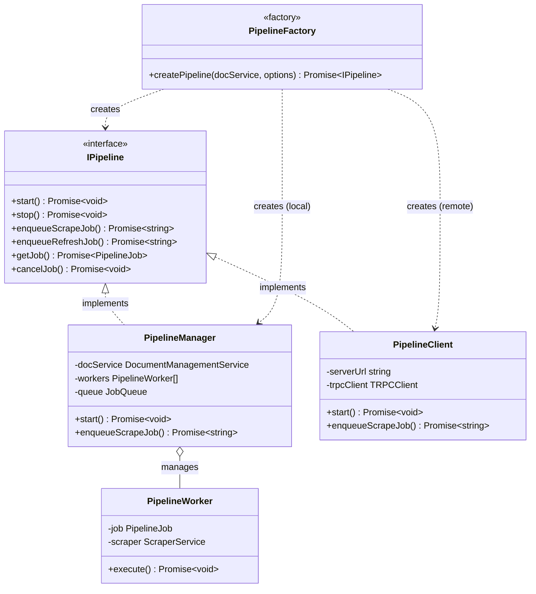
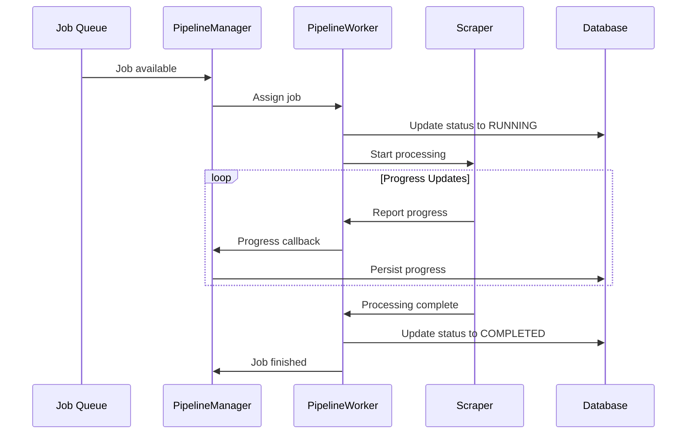
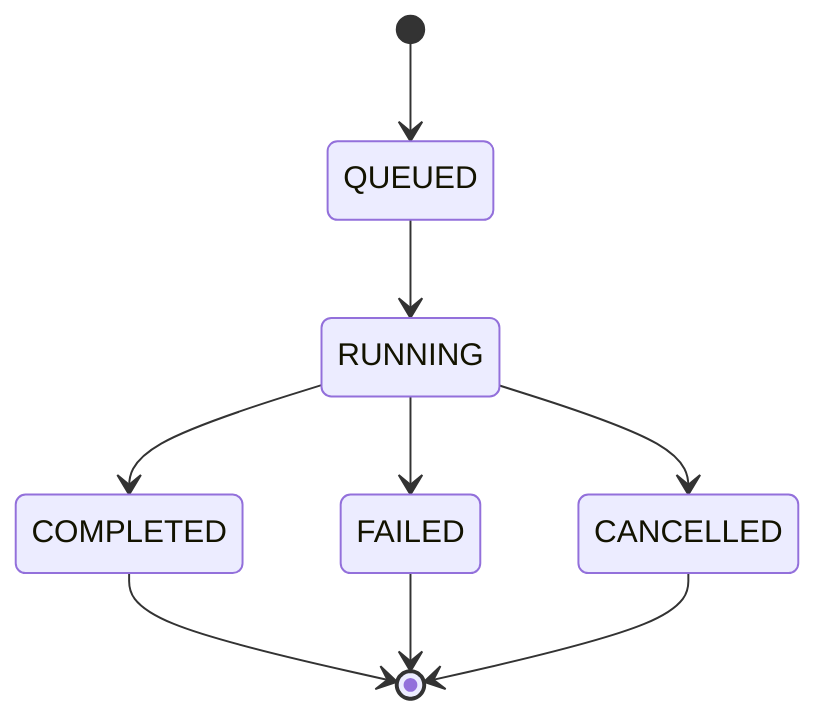
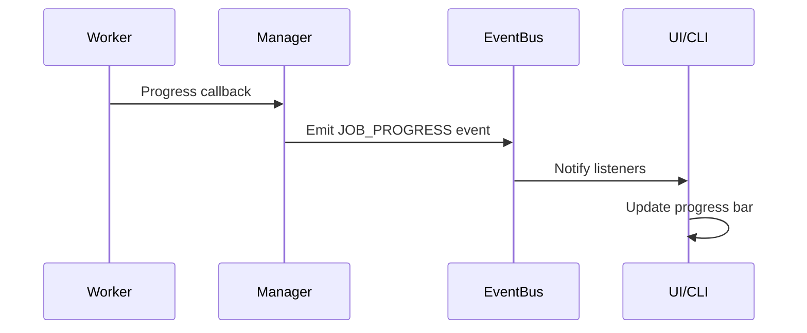
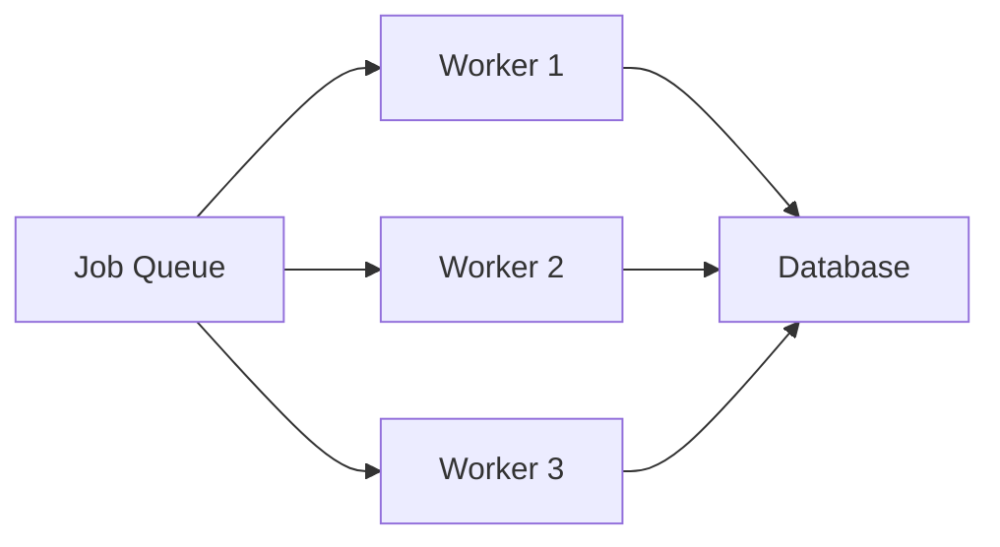
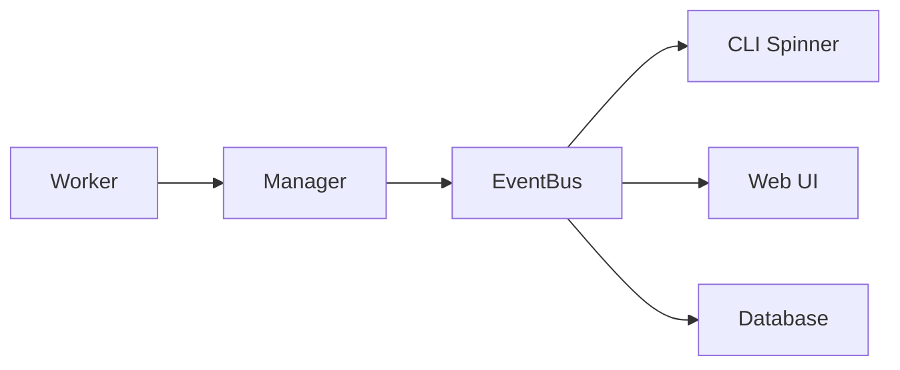

The pipeline system manages asynchronous document processing with persistent job state and coordinated execution across embedded or external workers.

## Architecture Pattern

The pipeline uses a Factory pattern to provide a unified interface for both local and remote job processing:



**Code References**:
- `src/pipeline/PipelineFactory.ts` - Factory implementation
- `src/pipeline/trpc/interfaces.ts:20-35` - IPipeline interface
- `src/pipeline/PipelineManager.ts` - Local implementation
- `src/pipeline/PipelineClient.ts` - Remote implementation

## Core Components

### Pipeline Factory

**Location**: `src/pipeline/PipelineFactory.ts`

Central factory that selects pipeline implementation based on configuration:

```typescript
interface PipelineOptions {
  recoverJobs?: boolean;   // Enable job recovery from database
  serverUrl?: string;      // External worker URL
  concurrency?: number;    // Worker concurrency limit
}
```

**Selection Logic**:

<Steps>
  <Step title="Check for External Worker">
    If `serverUrl` is specified → Create `PipelineClient`
  </Step>
  <Step title="Check Recovery Mode">
    If `recoverJobs: true` → Create `PipelineManager` with recovery
  </Step>
  <Step title="Default to Immediate Mode">
    If `recoverJobs: false` → Create `PipelineManager` without recovery
  </Step>
</Steps>

<Info>
Naming clarifies the mode: `PipelineManager` runs an in-process worker; `PipelineClient` connects to an out-of-process worker via tRPC.
</Info>

### Pipeline Manager

**Location**: `src/pipeline/PipelineManager.ts`

Manages job queue and worker coordination for embedded processing.

**Responsibilities**:
- Job queue management with concurrency limits
- Worker lifecycle management
- Progress tracking and status updates
- Database state synchronization
- Job recovery after restart

**Job Recovery**:

<Note>
On startup, the manager loads pending jobs from the database and resets `RUNNING` jobs to `QUEUED` for re-execution.
</Note>

**Recovery Process**:
1. Load `QUEUED` and `RUNNING` jobs from database
2. Reset `RUNNING` jobs to `QUEUED` state
3. Resume processing with original configuration
4. Maintain progress history

**Code Reference**: `src/pipeline/PipelineManager.ts`

### Pipeline Client

**Location**: `src/pipeline/PipelineClient.ts`

Type-safe tRPC client providing identical interface to PipelineManager for external worker communication.

**Features**:
- tRPC client for remote job operations over HTTP
- Identical method signatures to `PipelineManager`
- Error handling and connection management
- Connectivity check via `ping` procedure
- Event-driven job completion waiting

**Key Methods**:
```typescript
class PipelineClient implements IPipeline {
  async enqueueScrapeJob(options): Promise<string>
  async getJob(jobId): Promise<PipelineJob>
  async cancelJob(jobId): Promise<void>
  async waitForJobCompletion(jobId): Promise<PipelineJob>
}
```

### Pipeline Worker

**Location**: `src/pipeline/PipelineWorker.ts`

Executes individual jobs with progress reporting.

**Execution Flow**:



**Process Steps**:
1. Fetch job configuration from queue
2. Initialize scraper with job parameters
3. Process content through scraper pipeline
4. Update progress via callbacks
5. Store results and mark completion

**Code Reference**: `src/pipeline/PipelineWorker.ts`

## Job Lifecycle

### Job States



**State Descriptions**:

| State | Description |
|-------|-------------|
| `QUEUED` | Job created, waiting for worker |
| `RUNNING` | Worker processing job |
| `COMPLETED` | Successful completion |
| `FAILED` | Error during processing |
| `CANCELLED` | Manual cancellation |

### State Transitions

All state transitions persist to database and emit events:

```typescript
// Example state transition
await this.updateJobStatus(jobId, 'RUNNING');
// 1. Update in-memory job state
// 2. Persist to database
// 3. Emit JOB_STATUS_CHANGE event to EventBus
```

**Code Reference**: `src/pipeline/PipelineManager.ts`

### Progress Tracking

Jobs report progress through callback mechanism:

```typescript
interface ScraperProgressEvent {
  pagesDiscovered: number;
  pagesProcessed: number;
  currentUrl?: string;
  status: string;
  errors?: string[];
}
```

**Progress Flow**:


**Tracked Metrics**:
- Pages discovered and processed
- Current processing status
- Error messages and warnings
- Processing rate (pages/min)

## Write-Through Architecture

<Info>
Pipeline jobs serve as the single source of truth, containing both runtime state and database fields.
</Info>

### Consistency Guarantee

All state changes immediately synchronize to database:

```typescript
class PipelineManager {
  private async updateJobStatus(jobId: string, status: JobStatus) {
    // 1. Update in-memory state
    const job = this.jobs.get(jobId);
    job.status = status;
    
    // 2. Persist to database (write-through)
    await this.docService.updateVersion(jobId, { status });
    
    // 3. Emit event
    this.eventBus.emit('JOB_STATUS_CHANGE', job);
  }
}
```

**Benefits**:
- Immediate persistence ensures recovery capability
- No state drift between memory and database
- Event emission after persistence guarantees consistency

**Code Reference**: `src/pipeline/PipelineManager.ts`

### Recovery Mechanism

<Note>
Database state enables automatic recovery after crashes or restarts.
</Note>

**Recovery Process**:
1. Load pending jobs on startup
2. Reset `RUNNING` jobs to `QUEUED`
3. Resume processing with original configuration
4. Maintain progress history

```typescript
async start() {
  if (this.recoverJobs) {
    const pendingJobs = await this.loadPendingJobs();
    for (const job of pendingJobs) {
      if (job.status === 'RUNNING') {
        await this.updateJobStatus(job.id, 'QUEUED');
      }
      this.queue.push(job);
    }
  }
  this.startWorkers();
}
```

## Concurrency Management

### Worker Pool

PipelineManager maintains configurable worker pool:



**Configuration**:
- Default concurrency: 3 workers
- Configurable via `DOCS_MCP_CONCURRENCY` or `--concurrency`
- Workers process jobs independently
- Queue coordination prevents conflicts

**Code Reference**: `src/pipeline/PipelineManager.ts`

### Job Distribution

Jobs are distributed using FIFO queue with worker availability:

```typescript
private async processQueue() {
  while (this.queue.length > 0 && this.hasAvailableWorker()) {
    const job = this.queue.shift();
    const worker = this.getAvailableWorker();
    await worker.execute(job);
  }
}
```

**Strategy**:
- FIFO queue ordering
- Worker availability checking
- Load balancing across workers
- Graceful worker shutdown handling

## External Worker RPC

### tRPC Procedures

**Location**: `src/pipeline/trpc/router.ts`

Type-safe RPC procedures for remote worker communication:

| Procedure | Description |
|-----------|-------------|
| `ping` | Connectivity check |
| `enqueueJob` | Create new job |
| `getJobs` | List jobs with optional filtering |
| `getJob` | Get job details by ID |
| `cancelJob` | Cancel a running job |
| `clearCompletedJobs` | Remove finished jobs |
| `subscribeToEvents` | WebSocket subscription for events |

**Example Client Usage**:
```typescript
const client = createTRPCClient({
  url: 'http://worker:8080/api'
});

const jobId = await client.enqueueJob.mutate({
  libraryName: 'react',
  version: '18.0.0',
  url: 'https://react.dev'
});
```

### Data Contracts

<Info>
Requests and responses use shared TypeScript types through tRPC, ensuring end-to-end type safety.
</Info>

**Type Safety Flow**:
```typescript
// Shared types in src/types/
interface ScrapeJobOptions {
  libraryName: string;
  version: string;
  url: string;
  // ...
}

// Server procedure
const router = trpc.router({
  enqueueJob: trpc.procedure
    .input(z.object({ /* Zod schema */ }))
    .mutation(async ({ input }) => {
      // Type-safe input
      return jobId;
    })
});

// Client gets full type safety
const jobId = await client.enqueueJob.mutate(options);
```

### Error Handling

Errors propagate as structured tRPC errors:

```typescript
import { TRPCError } from '@trpc/server';

throw new TRPCError({
  code: 'BAD_REQUEST',
  message: 'Invalid job configuration'
});
```

**Error Codes**:
- `BAD_REQUEST`: Invalid input parameters
- `NOT_FOUND`: Job not found
- `INTERNAL_SERVER_ERROR`: Processing error
- `TIMEOUT`: Job execution timeout

## Configuration Persistence

### Job Configuration

Each job stores complete scraper configuration in the database:

```typescript
interface PipelineJob {
  id: string;
  libraryName: string;
  version: string;
  status: JobStatus;
  config: {
    url: string;
    maxDepth?: number;
    followLinks?: boolean;
    selectors?: string[];
    // ... all scraper options
  };
}
```

**Storage Location**: `versions.config` column (JSON)

**Code Reference**: `src/store/DocumentManagementService.ts`

### Reproducible Processing

<Note>
Stored configuration enables exact re-indexing with the same parameters, ensuring consistent results across runs.
</Note>

**Use Cases**:
- Re-index documentation with same settings
- Debug processing issues
- Audit configuration changes
- Version-specific processing rules

## Monitoring and Observability

### Progress Reporting

Real-time progress updates through multiple channels:



**Update Frequency**:
- Progress callbacks: Every page processed
- Database persistence: Every state change
- Event emission: Every update
- UI polling: Every 3 seconds (fallback)

**Code Reference**: `src/pipeline/PipelineWorker.ts`

### Error Tracking

Comprehensive error information:

```typescript
interface JobError {
  message: string;
  stack?: string;
  context: {
    url?: string;
    page?: number;
    retryCount: number;
  };
}
```

**Error Storage**:
- Exception stack traces
- Processing context at failure
- Retry attempt logging
- User-friendly error messages

**Code Reference**: `src/pipeline/PipelineManager.ts`

### Performance Metrics

Job execution metrics tracked:

- **Processing Duration**: Start to completion time
- **Pages Per Minute**: Processing rate
- **Memory Usage**: Peak memory consumption
- **Queue Depth**: Pending jobs count
- **Worker Utilization**: Active vs idle workers

## Scaling Patterns

### Vertical Scaling

Increase processing power within single process:

<CardGroup cols={2}>
  <Card title="Higher Concurrency" icon="arrows-split-up-and-left">
    Increase worker count with `--concurrency`
  </Card>
  <Card title="More Memory" icon="memory">
    Allocate more RAM for large documents
  </Card>
  <Card title="Faster Storage" icon="database">
    Use SSD for database and cache
  </Card>
  <Card title="Better CPU" icon="microchip">
    Faster processing per worker
  </Card>
</CardGroup>

**Configuration**:
```bash
docs-mcp-server --concurrency 10
```

### Horizontal Scaling

Distribute workers across processes:

<CardGroup cols={2}>
  <Card title="Multiple Workers" icon="server">
    Deploy separate worker containers
  </Card>
  <Card title="Load Balancer" icon="scale-balanced">
    Distribute jobs across workers
  </Card>
  <Card title="Independent Scaling" icon="up-right-and-down-left-from-center">
    Scale workers without coordinator
  </Card>
  <Card title="Connection Pool" icon="plug">
    Manage database connections
  </Card>
</CardGroup>

**Architecture**:
```bash
# Coordinator
docs-mcp-server mcp --server-url http://worker-lb:8080/api

# Workers (scaled independently)
docs-mcp-server worker --port 8080
```

### Hybrid Deployment

Combine embedded and external workers:

- Coordinator with embedded workers for baseline
- Additional external workers for peak load
- Flexible resource allocation
- Cost-optimized scaling

## Next Steps

<CardGroup cols={2}>
  <Card title="Event Bus" icon="broadcast-tower" href="/architecture/event-bus">
    Learn about real-time event architecture
  </Card>
  <Card title="Content Processing" icon="file-code" href="/architecture/content-processing">
    Understand content transformation
  </Card>
</CardGroup>
