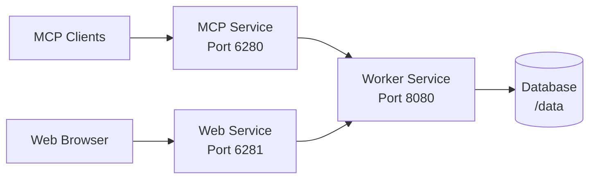

## Overview

The Docs MCP Server provides official Docker images for easy deployment in containerized environments. You can deploy as a single all-in-one container for simple setups, or use Docker Compose for distributed scaling with separate worker, MCP, and web services.

<Info>
  Official Docker images are available at `ghcr.io/arabold/docs-mcp-server:latest`
</Info>

## Single Container Deployment

The simplest way to run Docs MCP Server is as a single container with all services enabled.

### Quick Start

```bash
docker run -p 6280:6280 \
  -v docs-mcp-data:/data \
  -v docs-mcp-config:/config \
  ghcr.io/arabold/docs-mcp-server:latest
```

This starts the server with:
- All services enabled (worker, MCP, web)
- Data persistence in named volume `docs-mcp-data`
- Configuration persistence in named volume `docs-mcp-config`
- Default port 6280 exposed

### Environment Variables

<CodeGroup>

```bash Basic Configuration
docker run -p 6280:6280 \
  -e DOCS_MCP_STORE_PATH=/data \
  -e XDG_CONFIG_HOME=/config \
  -v docs-mcp-data:/data \
  -v docs-mcp-config:/config \
  ghcr.io/arabold/docs-mcp-server:latest
```

```bash With AI Provider
docker run -p 6280:6280 \
  -e OPENAI_API_KEY=your-api-key \
  -e DOCS_MCP_AI_EMBEDDING_PROVIDER=openai \
  -e DOCS_MCP_AI_EMBEDDING_MODEL=text-embedding-3-small \
  -v docs-mcp-data:/data \
  -v docs-mcp-config:/config \
  ghcr.io/arabold/docs-mcp-server:latest
```

```bash With Authentication
docker run -p 6280:6280 \
  -e DOCS_MCP_AUTH_ENABLED=true \
  -e DOCS_MCP_AUTH_ISSUER_URL="https://auth.your-domain.com" \
  -e DOCS_MCP_AUTH_AUDIENCE="https://mcp.your-domain.com" \
  -v docs-mcp-data:/data \
  -v docs-mcp-config:/config \
  ghcr.io/arabold/docs-mcp-server:latest
```

</CodeGroup>

### Volume Mounts

<Warning>
  **Data Persistence**: Always mount volumes for `/data` and `/config` to persist your indexed documentation and configuration across container restarts.
</Warning>

| Volume              | Purpose                                    | Required |
| ------------------- | ------------------------------------------ | -------- |
| `/data`             | Database, embeddings, installation ID      | Yes      |
| `/config`           | Configuration files (YAML)                 | Yes      |

## Docker Compose Deployment

For production deployments with scaling requirements, use Docker Compose to run separate services:

- **Worker**: Handles documentation processing (CPU/memory intensive)
- **MCP**: Provides MCP endpoint for AI tools (lightweight)
- **Web**: Serves web interface (lightweight)

### Architecture



### Docker Compose File

Create a `docker-compose.yml` file:

```yaml docker-compose.yml
services:
  # Worker service - handles the actual documentation processing
  worker:
    image: ghcr.io/arabold/docs-mcp-server:latest
    command: ["worker", "--host", "0.0.0.0", "--port", "8080"]
    container_name: docs-mcp-worker
    restart: unless-stopped
    ports:
      - "8080:8080"
    env_file:
      - .env
    volumes:
      - docs-mcp-data:/data
      - docs-mcp-config:/config
    healthcheck:
      test: 'node -e ''require("net").connect(8080, "127.0.0.1").on("connect",()=>process.exit(0)).on("error",()=>process.exit(1))'''
      interval: 5s
      timeout: 3s
      retries: 10
      start_period: 10s
    deploy:
      resources:
        limits:
          memory: 2G
        reservations:
          memory: 1G

  # MCP server - provides AI tool integration endpoint
  mcp:
    image: ghcr.io/arabold/docs-mcp-server:latest
    command:
      [
        "mcp",
        "--protocol",
        "http",
        "--host",
        "0.0.0.0",
        "--port",
        "6280",
        "--server-url",
        "http://worker:8080/api",
        "--no-logo",
      ]
    container_name: docs-mcp-server
    restart: unless-stopped
    ports:
      - "6280:6280"
    env_file:
      - .env
    volumes:
      - docs-mcp-config:/config
    depends_on:
      worker:
        condition: service_healthy
    deploy:
      resources:
        limits:
          memory: 512M
        reservations:
          memory: 256M

  # Web interface - provides browser-based management
  web:
    image: ghcr.io/arabold/docs-mcp-server:latest
    command:
      [
        "web",
        "--host",
        "0.0.0.0",
        "--port",
        "6281",
        "--server-url",
        "http://worker:8080/api",
        "--no-logo",
      ]
    container_name: docs-mcp-web
    restart: unless-stopped
    ports:
      - "6281:6281"
    env_file:
      - .env
    volumes:
      - docs-mcp-config:/config
    depends_on:
      worker:
        condition: service_healthy
    deploy:
      resources:
        limits:
          memory: 512M
        reservations:
          memory: 256M

volumes:
  docs-mcp-data:
    name: docs-mcp-data
  docs-mcp-config:
    name: docs-mcp-config
```

### Environment File

Create a `.env` file for configuration:

```bash .env
# AI Provider Configuration
OPENAI_API_KEY=your-api-key-here
DOCS_MCP_AI_EMBEDDING_PROVIDER=openai
DOCS_MCP_AI_EMBEDDING_MODEL=text-embedding-3-small

# Authentication (optional)
# DOCS_MCP_AUTH_ENABLED=true
# DOCS_MCP_AUTH_ISSUER_URL=https://auth.your-domain.com
# DOCS_MCP_AUTH_AUDIENCE=https://mcp.your-domain.com

# Telemetry (optional)
# DOCS_MCP_TELEMETRY=false

# Storage Configuration
DOCS_MCP_STORE_PATH=/data
XDG_CONFIG_HOME=/config
```

<Warning>
  **Security**: Never commit the `.env` file to version control. Add it to `.gitignore` to prevent accidentally exposing API keys and secrets.
</Warning>

### Start Services

<CodeGroup>

```bash Start All Services
# Start all services in detached mode
docker compose up -d

# View logs
docker compose logs -f

# View specific service logs
docker compose logs -f worker
```

```bash Stop Services
# Stop all services
docker compose down

# Stop and remove volumes (DELETES DATA)
docker compose down -v
```

```bash Restart Services
# Restart all services
docker compose restart

# Restart specific service
docker compose restart worker
```

```bash Scale Services
# Scale worker service (requires load balancer)
docker compose up -d --scale worker=3
```

</CodeGroup>

## Container Configuration

### Dockerfile Details

The official Dockerfile uses a multi-stage build for optimal image size:

```dockerfile
# Base stage with build dependencies
FROM node:22-slim AS base

WORKDIR /app

# Install build dependencies for native modules
RUN apt-get update \
  && apt-get install -y --no-install-recommends \
  python3 \
  make \
  g++ \
  && rm -rf /var/lib/apt/lists/*

# Build stage
FROM base AS builder

# Accept build argument for PostHog API key
ARG POSTHOG_API_KEY
ENV POSTHOG_API_KEY=$POSTHOG_API_KEY

COPY package*.json ./
RUN npm ci

COPY . .
RUN npm run build

# Production stage
FROM base AS production

# Set environment variables for Playwright
ENV PLAYWRIGHT_SKIP_BROWSER_DOWNLOAD=1
ENV PLAYWRIGHT_CHROMIUM_EXECUTABLE_PATH=/usr/bin/chromium

# Install Chromium from apt-get
RUN apt-get update \
  && apt-get install -y --no-install-recommends \
  chromium \
  && rm -rf /var/lib/apt/lists/*

# Copy built files
COPY package*.json .
COPY db db
COPY --from=builder /app/node_modules ./node_modules
COPY --from=builder /app/public ./public
COPY --from=builder /app/dist ./dist

# Set data directory
ENV DOCS_MCP_STORE_PATH=/data
ENV XDG_CONFIG_HOME=/config

# Define volumes
VOLUME /data
VOLUME /config

# Expose default port
EXPOSE 6280
ENV PORT=6280
ENV HOST=0.0.0.0

ENTRYPOINT ["node", "--enable-source-maps", "dist/index.js"]
```

### Key Features

- **Multi-stage build**: Minimal production image size
- **Native modules**: Pre-compiled better-sqlite3 and tree-sitter
- **Chromium**: Included for web scraping with Playwright
- **Source maps**: Enabled for better error debugging
- **Volumes**: Persistent data and config storage

## Service Ports

| Service | Port | Purpose                          |
| ------- | ---- | -------------------------------- |
| Worker  | 8080 | Internal API (tRPC)              |
| MCP     | 6280 | MCP endpoint for AI tools        |
| Web     | 6281 | Web interface                    |

<Warning>
  **Network Security**: In Docker Compose setups, the worker's tRPC API (port 8080) is only accessible within the Docker network. Never expose this port to the public internet without additional authentication.
</Warning>

## Resource Limits

Recommended resource allocations:

| Service | Memory Limit | Memory Reservation | CPU Usage       |
| ------- | ------------ | ------------------ | --------------- |
| Worker  | 2G           | 1G                 | High (processing)|
| MCP     | 512M         | 256M               | Low (proxy)     |
| Web     | 512M         | 256M               | Low (frontend)  |

### Scaling Considerations

- **Worker**: CPU/memory intensive, scale vertically or use job queues
- **MCP/Web**: Lightweight, can scale horizontally with load balancer
- **Database**: Single SQLite file, shared via volume (worker only)

## Health Checks

The worker service includes a health check to ensure proper startup:

```yaml
healthcheck:
  test: 'node -e ''require("net").connect(8080, "127.0.0.1").on("connect",()=>process.exit(0)).on("error",()=>process.exit(1))'''
  interval: 5s
  timeout: 3s
  retries: 10
  start_period: 10s
```

This ensures MCP and Web services only start after the worker is ready.

## Troubleshooting

<AccordionGroup>
  <Accordion title="Container fails to start">
    Check logs for errors:
    ```bash
    docker compose logs worker
    ```
    
    Common issues:
    - Missing API keys in `.env` file
    - Volume permission issues
    - Port conflicts
  </Accordion>

  <Accordion title="Services can't connect to worker">
    Verify health check is passing:
    ```bash
    docker compose ps
    ```
    
    Check worker is healthy before MCP/Web start. Increase `start_period` if needed.
  </Accordion>

  <Accordion title="Database locked errors">
    SQLite doesn't support multiple writers. Ensure only one worker service is running:
    ```bash
    docker compose ps | grep worker
    ```
    
    If scaling workers, implement external job queue.
  </Accordion>

  <Accordion title="Out of memory errors">
    Increase memory limits in `docker-compose.yml`:
    ```yaml
    deploy:
      resources:
        limits:
          memory: 4G  # Increase from 2G
    ```
  </Accordion>
</AccordionGroup>

## Production Best Practices

<Warning>
  ### Security Checklist

  - Use `.env` file for secrets (never commit to git)
  - Enable authentication for MCP endpoints if exposing publicly
  - Keep worker API (port 8080) internal to Docker network
  - Use HTTPS termination (reverse proxy like Traefik/nginx)
  - Regularly update images: `docker compose pull && docker compose up -d`
  - Implement backup strategy for `/data` volume
</Warning>

### Monitoring

- **Logs**: Use `docker compose logs -f` for real-time monitoring
- **Health**: Check service health with `docker compose ps`
- **Resources**: Monitor with `docker stats`
- **Telemetry**: Enable telemetry for usage insights (enabled by default)

### Backup Strategy

```bash
# Backup data volume
docker run --rm -v docs-mcp-data:/data -v $(pwd):/backup \
  alpine tar czf /backup/docs-mcp-data-backup.tar.gz /data

# Restore data volume
docker run --rm -v docs-mcp-data:/data -v $(pwd):/backup \
  alpine tar xzf /backup/docs-mcp-data-backup.tar.gz -C /
```

### Updates

```bash
# Pull latest images
docker compose pull

# Restart with new images (zero-downtime with proper load balancing)
docker compose up -d
```

## Advanced Configurations

### Custom Configuration File

Mount a custom `docs-mcp.config.yaml`:

```yaml docker-compose.yml
volumes:
  - ./docs-mcp.config.yaml:/config/docs-mcp.config.yaml:ro
```

### Reverse Proxy (Traefik)

```yaml docker-compose.yml
mcp:
  labels:
    - "traefik.enable=true"
    - "traefik.http.routers.mcp.rule=Host(`mcp.your-domain.com`)"
    - "traefik.http.routers.mcp.entrypoints=websecure"
    - "traefik.http.routers.mcp.tls.certresolver=letsencrypt"
    - "traefik.http.services.mcp.loadbalancer.server.port=6280"
```

### Multiple Workers (Requires External Queue)

<Warning>
  SQLite doesn't support multiple concurrent writers. To scale workers, you need to implement an external job queue (Redis, RabbitMQ, etc.) or use a different database backend.
</Warning>
